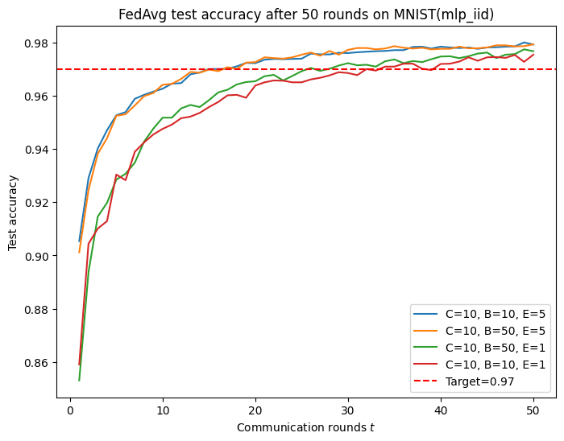
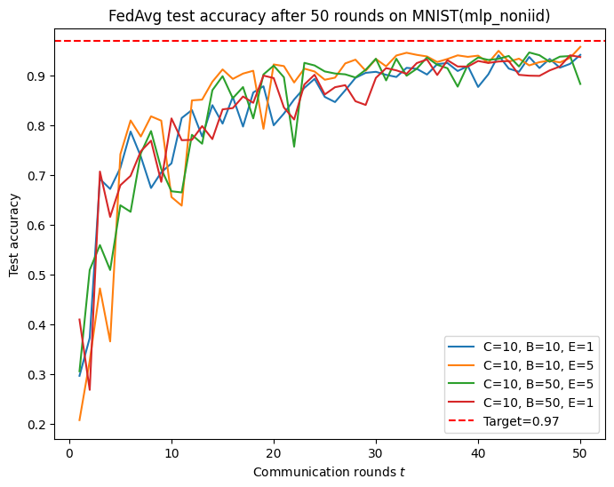
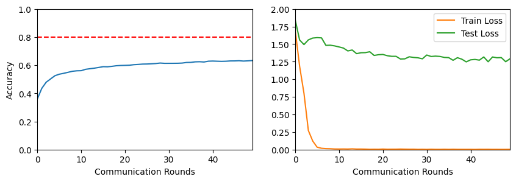

# Federated Averaging

This is a reproduction of [Communication-Efficient Learning of Deep Networks from Decentralized Data](https://arxiv.org/pdf/1602.05629).

Experiments conducted on 3 datasets: MNIST, CIFAR10 and Shakespeare.

## Setup
1. Navigate to the directory and execute `layout.sh` in the terminal.
```bash
chmod +x layout.sh
./layout.sh
```

2. To obtain the dataset for Shakespeare, first [download dataset](https://gutenberg.org/files/100/old/1994-01-100.zip), follow the [instructions](https://github.com/TalwalkarLab/leaf/tree/master/data/shakespeare) provided, and run the following command to generate the corresponding `.json` files
```bash
./preprocess.sh -s niid --sf 0.2 -k 0 -t sample -tf 0.8
```

3. Place the generated files under `./data/shakespeare`. 

After completing the above steps, the file structure should resemble the following:
```
.
├── README.md
├── data
│   └── shakespeare
├── exp_cifar10.ipynb
├── exp_mnist.ipynb
├── exp_shakespeare.ipynb
├── img
│   ├── CIFAR10
│   ├── MNIST
│   └── SHAKESPEARE
├── layout.sh
├── requirements.txt
├── src
│   ├── config.py
│   ├── data_utils.py
│   ├── fl_devices.py
│   ├── helper.py
│   ├── models.py
│   ├── sampling.py
│   └── simulate.py
└── stats
    ├── CIFAR10
    ├── MNIST
    └── SHAKESPEARE
```

The simulator is implemented in `fl_devices.py` and `simulate.py`. Experiments are saved separately in `xxx.ipynb`.

## Results 

The experiments tested the major parameters in the `FedAvg` algorithm:
- `C`: fraction of clients that perform computation in each round 
- `B`: local minibatch size used for the client updates
- `E`: number of training passes at each client over the local data in each round

For each dataset, the simulation consist of the following steps:
- Load data
- Sample (IID VS non-IID)
- Model
- Train

The target performance from the paper (with a default number of clients = 100) is as follows:

| | MNIST MLP IID | MNIST MLP non-IID | MNIST CNN IID | MNIST CNN non-IID | CIFAR10 CNN IID | Shakespeare stacked-LSTM non-IID |
| -------- | -------- | ------- | -------- | ------- | -------- | ------- |
| (C,B,E) | (10,10,1) | (10,10,1) | (10,10,5) | (10,10,5) | (10,50,5) | (10,50,5) | 
| Target Rounds | 87 | 664 | 18 | 206 | 280 | 60 | 
| Target Accuracy | 97% | 97% | 99% | 99% | 80% | 54% | 
| Actual Rounds | 50 | 50 | 50 | 50 | 50 | 20 | 
| Accuracy after Actual Rounds | 97%(32) | 94% | 98% | 98% | - | - | 

Here are some examples of the graphs:

**exp_mnist.ipynb**




**exp_cifar10.ipynb**



## To do:
- Improve the results on CIFAR10 and Shakespeare
- Increasing parallelism
- Improve GPUs usage